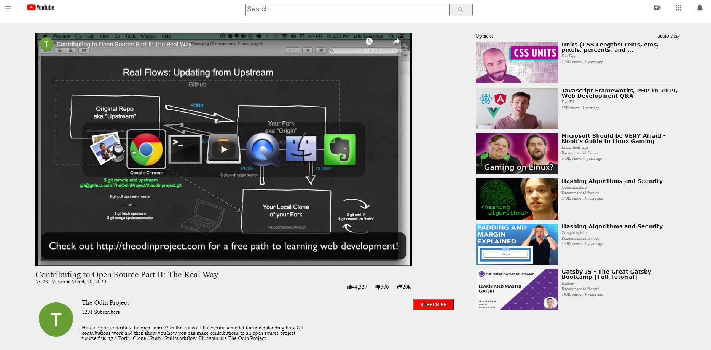

# EMBEDDING IMAGES AND VIDEO (Microverse Collaborative Project)

> This project centers on the use of plain HTML and CSS to embed images and videos in a web page.
> A reproduction of a youtube home page was used to complete the project

## Built With

- HTML & CSS

## Live Demo

- Coming Soon (John will handle that)

## Authors

👤 **John Pius**

- Github (https://github.com/john4pius)
- Linkedin (https://www.linkedin.com/in/john-pius-5447b353/)
- Twitter (@John4pius)

👤 **Ahmed Ben Jmii**

* Ahmed (https://github.com/Ahmed-Benj)
* Linkedin (https://www.linkedin.com/in/ahmed-b-05600992/)

## 🤝 Contributing

Contributions, issues and feature requests are welcome!

Feel free to check them https://github.com/john4pius/youtube-video-player-page/issues.

## Show your support

Give a ⭐️ if you like this project!